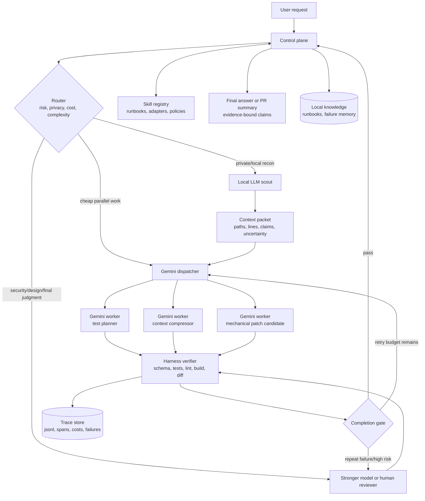

# Secure Enterprise AX Gemini Worker Playbook

This playbook is for a locked-down enterprise workstation where AI agents are
contracted through approved enterprise channels, local context is sensitive, and
Gemini is available as a lower-cost cloud worker. It assumes a stronger control
plane owns task framing, routing, verification, and final claims.

It is intentionally model-neutral where possible. Product names appear only as
adapter examples.

## Operating Claim

Use Gemini as a high-throughput worker, dispatcher, compressor, and verifier
assistant. Do not use it as the final authority for code correctness, security,
production readiness, or private-context release.

The practical pattern is:

```text
strong control plane -> local scout -> Gemini contract workers -> verifier
                   \-> stronger model for judgment, security, or repeated failure
```

The system is only as strong as its harness. Prompt text can guide behavior, but
runtime logs, schema validation, tests, diffs, approvals, and human review create
the real control boundary.

## Drawback Remediation

| Known Drawback | Mitigation In This Playbook |
| --- | --- |
| Markdown cannot enforce behavior. | Use `runtime-enforcement-bridge.md` to convert instructions into schema validation, allowlists, sandbox/worktree execution, retry caps, diff inspection, and observed-evidence gates. |
| Initial setup is expensive. | Start with P1 audited mode, then add P2 guarded writers, then add P3 enterprise controls only for CI, production, credentials, hardware, or private repositories. |
| Full process can slow small tasks. | Use mode routing: `fast_read` for tiny read-only work, `fast_worker` for public/internal non-edit work, `standard_edit` for scoped edits, and `high_risk` for sensitive changes. |
| Gemini can be verbose, loopy, or over-eager. | Enforce JSON-only responses, max output tokens, max tool calls, max changed files, one retry for the same error, and patch intent before edits. |
| Strict evidence gates can make agents timid. | Give low-risk modes explicit fast paths and allow `proposed` outputs without claiming completion. Escalate only when evidence is required and missing. |
| Product docs drift. | Use `maintenance-private-layer.md` for source freshness, release-note cadence, and adapter-owned product names. |
| Enterprise-specific details do not belong in public docs. | Keep reusable schemas public and real endpoints, repo names, commands, schedules, approvals, logs, and eval results in a private layer. |

## Architecture



## Gemini Role Map

| Role | Use Gemini For | Do Not Let Gemini Do |
| --- | --- | --- |
| Dispatcher | Split a task into narrow work orders with allowed tools and expected evidence. | Own final routing or security policy decisions. |
| Context compressor | Convert local scout output into file/path/line/evidence packets. | Upload raw private repository context without a release rule. |
| Test planner | Propose regression tests, smoke checks, and failure repro commands. | Claim tests passed without observed command output. |
| Patch candidate generator | Produce small, reversible patch intent for low-risk changes. | Edit broad architecture, secrets, auth, prod config, or generated/vendor files unsupervised. |
| Diff claim extractor | Extract claims implied by a diff and the evidence needed to support them. | Approve the diff. |
| Batch worker | Run bulk summarization, option generation, or low-risk artifact drafting. | Block an interactive workflow on 24-hour batch turnaround. |

## Routing Matrix

| Task Type | First Tier | Escalate When |
| --- | --- | --- |
| Local file discovery, logs, symbol search | Local scout | Scout cannot cite files/lines or repeats the same miss twice. |
| Context packet cleanup | Gemini compressor | Packet contains unsupported claims or raw private data. |
| Test ideas, docs, boilerplate, migration inventory | Gemini worker | Output fails schema validation or exceeds scope. |
| Small mechanical code candidate | Gemini worker plus harness | Test/build/diff evidence fails twice. |
| Architecture, security, data integrity, production, approvals | Stronger model or human | Always high-risk by default. |
| Final user report or public release claim | Control plane | Never delegated. |

## Enterprise Control Baseline

For a security-sensitive workstation, put a local enterprise broker between the
PC and any cloud model endpoint:

```text
agent UI -> local broker -> policy/redaction -> approved model endpoint
        -> local tool broker -> allowlisted tools -> sandbox/worktree
```

The broker should enforce:

- Data classification before any model call.
- `store: false` or equivalent zero-retention controls where the approved API
  supports them.
- No grounding, file upload, explicit cache, or batch use for confidential data
  unless the enterprise policy explicitly approves the retention profile.
- Prompt/content logging disabled for sensitive prompts; telemetry may record
  metadata, costs, spans, tool names, and hashes.
- Per-agent identity, least privilege, and separate credentials for automation.
- Egress control through an approved gateway or proxy.
- MCP/tool allowlists and per-tool input validation.
- A temporary branch/worktree for any write path.
- Human approval for destructive, external, production, credential, or hardware
  actions.

If deploying managed agents, prefer enterprise controls such as Agent Runtime,
Agent Gateway, Agent Identity, IAM, private connectivity, tracing, and Model
Armor-style prompt/response policy. If running locally, emulate those controls
with allowlists, sandboxing, central settings, trace logs, and review gates.

## From Guidance To Enforcement

Apply the enforcement ladder from `adapters/runtime-enforcement-bridge.md`:

1. P1, Audited: all Gemini workers must emit JSON and every run records
   `work-order.json`, `worker-output.json`, and `gate-result.json`.
2. P2, Guarded: any worker that can write must run inside a sandbox or temporary
   branch/worktree with command and write-root allowlists.
3. P3, Enforced: CI, private repositories, production-adjacent tasks, and
   credentials require broker-level policy, identity, approval, and egress
   controls.

Do not wait for a full platform to start. Make schema validation and trace logs
the first hard gate; they remove most of the "fluent but unverifiable" failure
mode.

## Data Release Rules

| Data Class | Cloud Worker Rule | Allowed Form |
| --- | --- | --- |
| Public | Allowed through approved endpoint. | Raw or summarized. |
| Internal | Allowed only through approved enterprise endpoint and trace policy. | Minimal excerpts, no secrets. |
| Confidential | Local-first; cloud only after redaction and policy approval. | File names, symbol names, short snippets, hashes, error classes. |
| Secret | Never send to Gemini or any model worker. | Block and escalate. |

The local scout should prefer evidence packets over raw files. A useful packet
contains paths, line numbers, symbol names, command summaries, and uncertainty,
not entire source trees.

Enterprise contracts reduce provider-side risk, but they do not remove the need
for a private operational layer. Public repositories should not expose real repo
names, proxy routes, scheduler names, command allowlists, approval chains,
incident patterns, internal tickets, cost centers, or proprietary eval results.
Put those values in a private adapter and keep this public repo as the portable
shape.

## Work Order Contract

Gemini receives one work order at a time:

```json
{
  "task_id": "T-014",
  "role": "test_planner",
  "goal": "Create regression coverage for the observed pricing bug.",
  "inputs": [
    {"kind": "context_packet", "ref": "runs/T-014/scout.json"}
  ],
  "allowed_actions": ["read_referenced_files", "propose_tests"],
  "forbidden_actions": [
    "edit_unreferenced_files",
    "claim_test_passed",
    "request_external_network",
    "touch_secrets_or_credentials"
  ],
  "done_when": [
    "Each proposed test maps to a cited behavior path.",
    "Each claim has file and line evidence or is listed as unresolved."
  ],
  "retry_budget": 1,
  "escalate_if": [
    "Required evidence is missing.",
    "The same schema or verification failure repeats.",
    "The task crosses security, production, or destructive boundaries."
  ]
}
```

Gemini responds only with a schema-bound result:

```json
{
  "task_id": "T-014",
  "status": "proposed",
  "actions_taken": [],
  "files_referenced": [
    {"path": "tests/test_cart.py", "lines": "12-48", "why": "pricing tests"}
  ],
  "proposed_changes": [
    {
      "path": "tests/test_cart.py",
      "intent": "Add combined coupon/member discount regression test."
    }
  ],
  "expected_verification": ["pytest tests/test_cart.py"],
  "claims": [
    {
      "claim": "Existing tests cover single discount paths only.",
      "evidence": {"path": "tests/test_cart.py", "line": 18}
    }
  ],
  "unresolved": []
}
```

## Gemini Failure Suppression

Gemini's common worker failures are handled as runtime gates, not as reminders:

| Failure | Suppression Control |
| --- | --- |
| Decorative prose or inflated reports | `response_schema`, JSON-only prompt wrapper, `prose_allowed=false`, low `max_output_tokens`. |
| Repetition loop | `max_tool_calls`, `max_same_error_retries=1`, wall-clock timeout, and stuck-pattern detection. |
| Over-editing | `max_changed_files`, `write_roots`, patch intent review, and diff scope gate. |
| Tool misuse | Tool allowlist, denied shell patterns, MCP allowlist, and untrusted-input read-only mode. |
| False completion | Final claims require observed command output, exit codes, diff inspection, or unresolved disclosure. |
| Excessive tool calls | Lower `thinking_level` for mechanical roles and add an explicit "no tools unless needed by work order" system rule. |

Recommended worker wrapper:

```text
Return only JSON. No markdown. No preamble. No apology. No completion claim.
Use at most N tool calls. If the next action is not in allowed_actions, set
status to needs_escalation. If evidence is missing, list it in unresolved.
```

## Optional Recovery Automation

Do not treat automatic repair as a default feature of this public repo.

This repo should only preserve an evidence-bounded possibility note in
`adapters/recovery-automation-possibility.md`. Whether to enable any scheduled
or event-triggered recovery flow must be decided on the enterprise PC or in a
private operations repository, because the real scheduler, allowlists, repo
paths, commands, retention settings, alert channels, and approval boundaries are
private operational data.

Public evidence supports only a narrow claim: deterministic workflow loops,
repository automation, and schema-bound worker calls are possible. It does not
prove unattended repair is safe for proprietary code, production-adjacent
systems, credentials, devices, or untrusted CI input.

Allowed public guidance:

- Possible use: read-only diagnosis, flaky-check re-run with captured logs,
  runbook note generation, or branch-only patch proposal.
- Required posture: manual or read-only by default.
- Private decision gate: enable only after the enterprise layer defines repo and
  command allowlists, input trust rules, retention policy, telemetry policy,
  branch/worktree behavior, human approval boundaries, and rollback.

Rejected public default:

- No scheduled writes from this protocol.
- No auto-merge, auto-release, auto-deploy, auto-posting, secret repair,
  credential repair, firewall change, database migration, hardware flashing, or
  broad dependency upgrade.
- No real internal routine names, scheduler paths, service names, alert channels,
  traces, or enablement switches in the public repo.

If the private layer approves a pilot, start with this shape:

```text
manual or scheduled trigger -> approved read-only check -> local log capture
-> local scout evidence packet -> optional Gemini schema-bound diagnosis
-> broker validation -> human review
```

Move to branch-only patch proposals only after the read-only pilot demonstrates
schema validity, no private-data leakage, bounded latency, and useful human
review outcomes.

## Lessons From Public Signals

| Signal | Source Type | Playbook Decision |
| --- | --- | --- |
| ADK supports specialized agents, workflow agents, hierarchy, sequential, parallel, and loop orchestration. | Official Google Cloud | Model the AX environment as a small specialist team, not one super-agent. |
| ADK `LoopAgent` runs sub-agents for a specified number of iterations or until a termination condition, with deterministic workflow control rather than model-owned orchestration. | Official ADK docs | Recovery automation is technically plausible, but any loop must be private-layer approved and bounded. |
| Gemini API supports JSON-schema structured output for agentic workflows. | Official Gemini docs | Make schema validation a hard gate for every Gemini worker. |
| Gemini thinking controls allow lower thinking for simple tasks and budget control for cost. | Official Gemini docs | Set thinking budget by role instead of using one default. |
| Gemini context caching and batch jobs reduce repeated-context cost but batch is not interactive. | Official Gemini docs | Cache stable runbooks and use batch only for offline jobs. |
| Gemini CLI subagents isolate complex or high-volume tasks in separate context windows. | Official GitHub discussion | Prefer isolated worker contexts over one overloaded session. |
| Public Gemini CLI issue reports custom skills/subagents may not be chosen automatically. | GitHub issue, anecdotal but product-adjacent | The control plane should invoke skills explicitly; do not rely on model discovery. |
| Official GitHub Action guidance recommends WIF, branch protection, pinned actions, least privilege, and trusted/untrusted input separation. | Official Google GitHub docs | Treat repository automation as CI security work, not just prompt design. |
| Gemini enterprise guidance supports central settings, tool/MCP allowlists, sandboxing, proxy control, telemetry, and disabling YOLO mode. | Official Gemini CLI docs | Use central policy controls; prompts are not enough. |
| HN users report Gemini can be useful for large-codebase investigation and summary for a stronger reviewer. | Community anecdote | Use Gemini as scout/compressor or bulk investigator, then re-check with stronger control. |
| HN users report loops, repeated tool failures, over-editing, and rate-limit confusion. | Community anecdote | Add retry budgets, stuck detection, provider fallback, and final diff review. |
| Reddit examples route Gemini/Antigravity as executor while a stronger model handles design/verification. | Community anecdote | Adopt "frontier conductor, cheap executor, verifier gate" as the default shape. |
| Security-oriented Gemini CLI guidance emphasizes project instruction files, tests, lint, and security scans. | Vendor practitioner article | Put policy and verification commands in repo instructions and make scans observable. |
| Public issue reports describe destructive behavior under broad/no-sandbox permissions and data overwrite risk. | GitHub issue/community anecdote | Disable YOLO, block root/workspace-wide deletes, snapshot writable state, and prefer append-safe memory tools. |

Community anecdotes are not proof of general performance. They are used here as
risk discovery signals and must be validated locally.

## Case Matrix

| Channel | Useful Pattern To Keep | Failure To Design Against |
| --- | --- | --- |
| Official Gemini GitHub Actions | Async issue triage, PR review, and on-demand delegated repo work. | Treating CI text from issues, PRs, and forks as trusted instructions. |
| Official Gemini enterprise docs | Central settings, sandboxed tools, MCP allowlists, telemetry, and disabled YOLO mode. | Assuming local user prompt rules can replace admin/runtime controls. |
| Official ADK/A2A docs | Specialized agents, workflow agents, explicit invocation, state, sequential/parallel/loop patterns. | Building one overloaded "super-agent" with too many tools and instructions. |
| GitHub issues/discussions | Subagents isolate work; skills may need explicit invocation. | Skill non-use, looping, long delays, quota surprises, broad destructive actions, and overwritten unversioned state. |
| Hacker News | Gemini can investigate large codebases and summarize for a stronger reviewer. | Weak autonomous editing, repeated tool failure, rate-limit opacity, and over-editing. |
| Reddit | Stronger conductor plus Gemini/Antigravity executor can reduce grunt-work cost. | Quota burn, immature harness behavior, weak interruption, and deletion stories under broad filesystem access. |
| YouTube/tutorials | Useful enablement material for setup, demos, and mental models. | Treat transcriptless demos as proof of safety or quality. |
| Security blogs | Useful attack-surface discovery for CI, shell, trust, and workspace controls. | Copying exploit-prone workflow patterns without admission checks. |

## Vendor Dependency Exit Plan

Keep the architecture portable:

- Put model-specific names in adapters, not in core protocol.
- Make every worker communicate through JSON contracts that another model can
  implement.
- Store traces in open formats such as JSONL and OpenTelemetry.
- Keep deterministic tools outside the model provider.
- Maintain a model capability matrix with empirical local evals, not vendor
  marketing claims.
- Run a quarterly failover drill: replace Gemini worker with another approved
  cloud model or a local model for dispatcher/compressor/test-planner roles.
- Keep secrets, schedules, approvals, and policy in your own broker so changing
  model providers does not rewrite governance.

Gemini is a worker plug-in. The AX system should survive if Gemini is slower,
rate-limited, retired, or replaced.

## Maintenance Model

Use `adapters/maintenance-private-layer.md` as the operating rhythm:

- Weekly: review worker rejects, loops, broad diffs, and repeated escalations.
- Monthly: check Gemini, Antigravity, ADK, Agent Runtime, A2A, MCP, and security
  advisories for drift.
- Quarterly: rerun local evals and provider failover drills.
- Before public releases: scan for secrets, internal names, private paths,
  proprietary eval results, and overbroad claims.

Product-specific settings such as `thinking_level`, `store:false`, CLI trust
settings, or enterprise gateway names belong in adapters. The core playbook
should keep role contracts and evidence rules stable even when products move.

## Tomorrow Rollout

1. Create a repo allowlist and command allowlist.
2. Add a `runtime-capabilities.yaml` adapter for the enterprise workstation.
3. Add `runtime-enforcement-bridge.md` policy values for mode routing,
   allowlists, retry caps, output caps, and gate artifacts.
4. Add explicit worker contracts for `dispatcher`, `compressor`,
   `test_planner`, `patch_candidate`, and `diff_claim_extractor`.
5. Configure Gemini API or approved Antigravity/enterprise endpoint. Avoid
   relying on retired consumer Gemini CLI paths.
6. Configure the local broker: redaction, `store: false` where applicable,
   telemetry without prompt logging, model allowlist, proxy/gateway, and per-task
   budgets.
7. Put stable public runbooks and schemas in cached context where the API and
   retention policy support it.
8. Add a local trace file per run:

   ```text
   runs/<date>/<task-id>/trace.jsonl
   runs/<date>/<task-id>/scout.json
   runs/<date>/<task-id>/worker-result.json
   runs/<date>/<task-id>/verification.txt
   ```

9. Pilot on three low-risk tasks:
   - analysis-only repository inventory,
   - test generation without code edits,
   - one small mechanical patch in a temporary branch.
10. Score each run for schema validity, evidence quality, verification success,
   scope control, privacy compliance, cost, and latency.
11. Record recovery automation as a private-layer decision. Do not enable it
   from this public repo; pilot only read-only diagnosis first if the enterprise
   PC policy approves it.

## Metrics

Track per task, not only per token:

- `schema_valid`: Gemini output parsed and passed validation.
- `evidence_bound_claims`: final claims with file/line/command evidence.
- `verification_passed`: exact commands and exit codes.
- `retry_count`: retries before pass or escalation.
- `escalation_reason`: privacy, risk, repeated failure, missing evidence, or
  provider failure.
- `private_context_released`: none, summary only, approved excerpt, or blocked.
- `diff_scope`: expected files only or out-of-scope.
- `latency_seconds` and `estimated_cost`.

## Public Repo Hygiene

Before publishing:

- Remove personal names, internal hostnames, repo paths, tokens, contract terms,
  security architecture details, ticket IDs, and proprietary model evaluations.
- Replace enterprise specifics with placeholders.
- Do not publish raw traces from private code.
- Label community reports as anecdotal.
- Do not claim Gemini, local LLMs, or this protocol provide safety enforcement.
- Do not claim lower models become frontier-equivalent.

## Minimum Viable Policy

```yaml
gemini_worker_policy:
  default_role: "contract_worker"
  final_judgment_allowed: false
  raw_private_context_allowed: false
  output_schema_required: true
  max_code_retry_attempts: 2
  max_diagnostic_retry_attempts: 3
  worker_limits:
    max_tool_calls: 8
    max_same_error_retries: 1
    max_changed_files: 3
    max_output_tokens: 1200
    prose_allowed: false
  allowed_default_roles:
    - dispatcher
    - context_compressor
    - test_planner
    - patch_candidate_generator
    - diff_claim_extractor
  forbidden_without_human_approval:
    - production_change
    - credential_or_secret_action
    - external_post_or_email
    - destructive_command
    - hardware_or_device_state_change
    - broad_dependency_upgrade
  retention_controls:
    store_false_required: true
    grounding_for_confidential_data: false
    explicit_cache_for_confidential_data: false
    file_upload_for_confidential_data: false
    prompt_logging_allowed: false
  tool_controls:
    yolo_mode_allowed: false
    workspace_root_delete_allowed: false
    mcp_servers_require_allowlist: true
    shell_commands_require_allowlist: true
  verifier_source_of_truth:
    - git_diff
    - command_exit_code
    - test_output
    - lint_or_build_output
    - schema_validation
```
